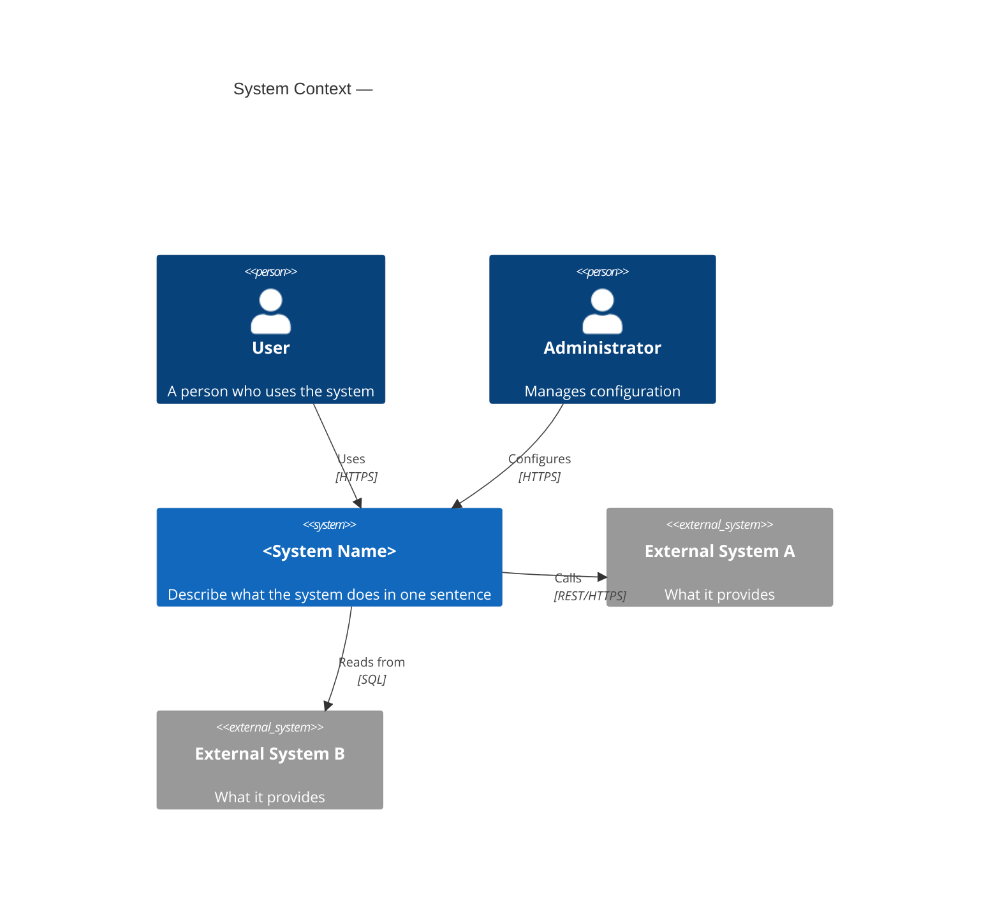
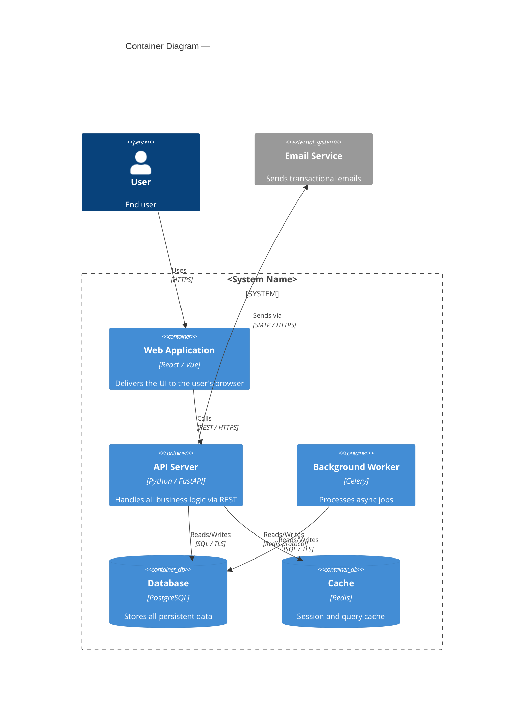
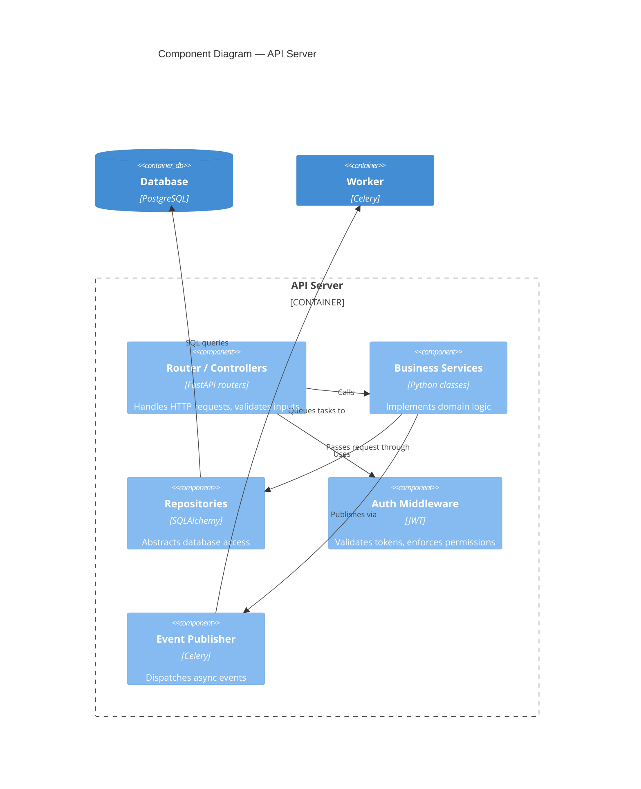
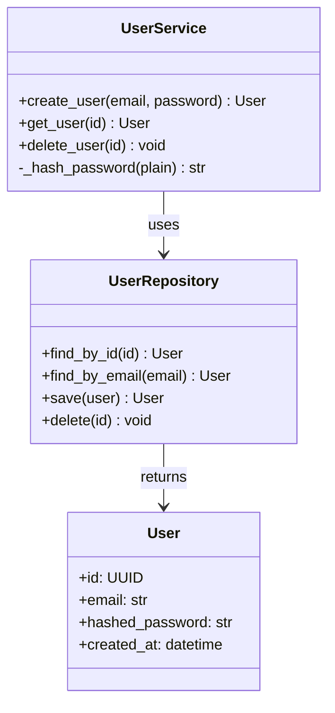

# C4 Model Diagrams Skill

The C4 model is a hierarchical set of architecture diagrams. Each level zooms in further into the system. Produce all four levels in `docs/c4.md` using Mermaid diagrams (rendered by most Markdown viewers) with ASCII fallback descriptions.

## Output file

Write all diagrams to `docs/c4.md`. If the file already exists, update only the sections affected by the current spec.

---

## Level 1 — System Context Diagram

Shows the system and its relationships with users and external systems. Highest level — no internal details.

**What to include:**
- The system being built (one box in the centre)
- Each type of human user / persona
- Each external system the solution integrates with
- Arrows showing data/interaction direction and a one-line label

**Mermaid template:**


**Source:** `spec.md` sections Context and Design — list all actors and integrations.

---

## Level 2 — Container Diagram

Zooms into the system boundary and shows major deployable/runnable units (containers). Each container runs in its own process/runtime.

**What to include:**
- Web apps, mobile apps, APIs, databases, message queues, file stores, caches
- The technology choice for each container
- Key interactions between containers and with external systems

**Mermaid template:**


**Source:** Implementation files, `spec.md` Design section, infrastructure configs (Dockerfile, CDK/Terraform).

---

## Level 3 — Component Diagram

Zooms into a single container and shows its internal components (modules, services, handlers, repositories).

**Produce one Component diagram for each major container** (e.g., API Server, Web Application).

**Mermaid template:**


**Source:** Source code files, module structure, import graphs. Read the actual code — don't guess.

---

## Level 4 — Code Diagram (optional)

Shows classes, interfaces, and their relationships within a single component. Only include if the component has non-obvious structure.

Use a plain class diagram:



---

## Full docs/c4.md structure

```markdown
# C4 Architecture Diagrams: <System Name>

> C4 Model — Version <N> — <YYYY-MM-DD>

---

## Level 1: System Context

<context mermaid diagram>

### External Actors

| Actor | Type | Interaction |
|-------|------|-------------|
| | | |

---

## Level 2: Container Diagram

<container mermaid diagram>

### Container Inventory

| Container | Technology | Purpose |
|-----------|-----------|---------|
| | | |

---

## Level 3: Component Diagrams

### <Container Name> Components

<component mermaid diagram>

#### Component Responsibilities

| Component | Responsibility | Key Files |
|-----------|---------------|-----------|
| | | |

---

## Level 4: Code Diagrams (key components only)

<class diagram for non-obvious components>

---

*Generated using the C4 Model — https://c4model.com*
```

---

## Instructions for the docs agent

1. **Output file**: `docs/c4.md`
2. **Create `docs/` directory** if it does not exist: `mkdir -p docs`
3. **Read source material** before writing diagrams:
   - `spec.md` → Level 1 (actors, external systems)
   - Infrastructure files (Dockerfile, CDK, Terraform, docker-compose) → Level 2 (containers)
   - Source code directory structure and imports → Level 3 (components)
4. **All Mermaid diagrams must use real names** from the codebase — no placeholder names like "Component A"
5. **Level 4 is optional** — only produce it for components with non-obvious internal structure
6. If Mermaid is not supported in the target environment, add an ASCII fallback after each diagram
